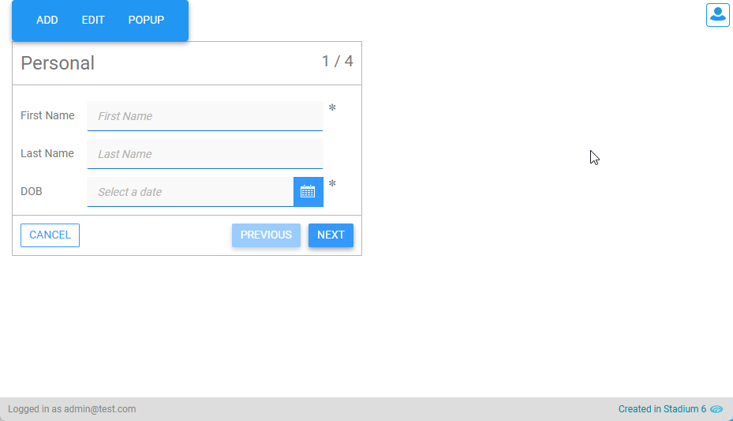
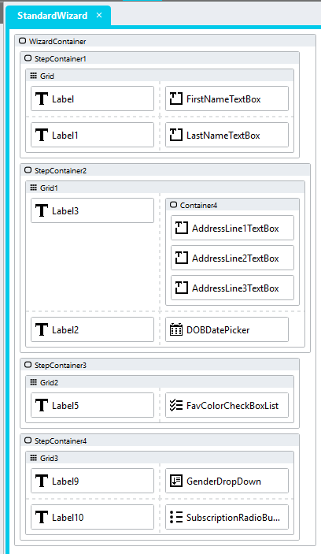
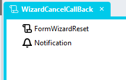
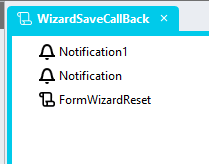
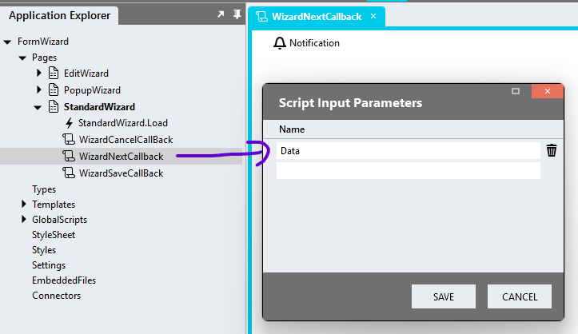

# Form Wizard

A module to generate multi-step forms.



## Overview
1. Add a *Container* control to a page (main container) and assign a unique class to the control classes property (e.g. form-wizard)
2. For each step in the wizard, add a Container control into the main container control (step containers)
3. Drag controls to show in each step into the relevant step containers
4. Create a List with the wizard step titles (type: Any)
5. Add the *WizardGenerate* Global Script to the page and configure the input parameters
6. Add two page scripts to handle the Save and Cancel callbacks

# Version
1.0

# Application Setup
1. Check the *Enable Style Sheet* checkbox in the application properties

## Generate Wizard Global Script
1. Create a Global Script called "FormWizardGenerate"
2. Add the input parameters below to the Global Script
   1. CancelCallback
   2. SaveCallback
   3. NextCallback
   4. WizardStepsConfig
   5. WizardContainerClass
3. Drag a *JavaScript* action into the script
4. Add the Javascript below into the JavaScript code property
```javascript
/* Stadium Script v1.0 https://github.com/stadium-software/form-wizard */
let scope = this;
let wizardClassName = "." + ~.Parameters.Input.WizardContainerClass;
let wizardSaveCallback = ~.Parameters.Input.SaveCallback;
let wizardCloseCallback = ~.Parameters.Input.CancelCallback;
let wizardNextCallback = ~.Parameters.Input.NextCallback;
let wizardConfig = ~.Parameters.Input.WizardStepsConfig || [];
const CONTROL_CONFIG = [
    { selector: ".date-picker-container", property: "Date" },
    { selector: ".text-box-container", property: "Text" },
    { selector: ".check-box-list-container", property: "SelectedOptions", isList: true },
    { selector: ".radio-button-list-container, .drop-down-container", property: "SelectedOption", isSelect: true }
];
const WIZARD_STYLES = `.stadium-wizard-container {
    display: flex;
    flex-direction: column;
    flex-wrap: nowrap;
    
    border: 1px solid var(--stadium-wizard-border-color, var(--DARK-GREY, #ccc));
    & .stadium-wizard-step {
        border-bottom: 1px solid var(--stadium-wizard-border-color, var(--DARK-GREY, #ccc));
        width: 100%;
        height: 100%;
        & .stadium-wizard-header {
            padding-top: var(--stadium-wizard-padding, 1rem);
            padding-bottom: var(--stadium-wizard-padding, 1rem);
        }
        & > .stack-layout-container {
            padding-left: var(--stadium-wizard-padding, 1rem);
            padding-bottom: var(--stadium-wizard-padding, 1rem);
        }
    }
    & .stadium-wizard-header {
        display: flex;
        justify-content: space-between;
        border-bottom: 1px solid var(--stadium-wizard-border-color, var(--DARK-GREY, #ccc));
        & .control-container {
            margin-top: 0;
            padding-right: 0;
        }
        & .stadium-wizard-header-title {
            font-size: var(--stadium-wizard-heading-font-size, 2.4rem);
            padding-left: var(--stadium-wizard-padding, 1rem);
            padding-right: var(--stadium-wizard-padding, 1rem);
        }
        & .stadium-wizard-step-counter {
            font-size: var(--stadium-wizard-counter-font-size, 2rem);
            padding-right: var(--stadium-wizard-padding, 1rem);
            white-space: nowrap;
        }
    }
    & .stadium-wizard-footer {
        display: flex;
        justify-content: space-between;
        padding: var(--stadium-wizard-padding, 1rem);
        & .control-container {
            margin-top: 0;
            padding-right: 0;
        }
        & .stadium-wizard-right-side {
            display: flex;
            gap: var(--stadium-wizard-padding, 1rem);
        }
        & .wizard-cancel-button-container {
            padding-right: var(--stadium-wizard-padding, 1rem);
        }
    }
    & .disabled-button {
        pointer-events: none;
        opacity: 0.5;
    }
    & .btn-lg {
        padding: var(--stadium-button-rightleft-padding, 0.4rem) var(--stadium-button-topbottom-padding, 1rem);
    }
}`;
let wizardContainer = document.querySelectorAll(wizardClassName);
if (wizardContainer.length == 0) {
    console.error("The container for the wizard was not found. Drag a container control into the page and assign the class '" + wizardClassName + "' to it.");
    return false;
} else if (wizardContainer.length > 1) {
    console.error("The class '" + wizardClassName + "' is assigned to multiple controls. Assign a unique classname to the wizard container");
    return false;
}
wizardContainer = wizardContainer[0];
wizardContainer.classList.add("stadium-wizard-container");
let contID = wizardContainer.id;
loadCSS();
let wait = async (milliseconds) => new Promise((resolve) => setTimeout(resolve, milliseconds));
let scriptCaller = async (script, params, attempt = 1) => {
    if (attempt > 20) {
        throw new Error(`Failed to call script "${script}" after 20 retries`);
    }
    try {
        await scope[script](params);
        return true;
    } catch (error) {
        console.warn(`scriptCaller: Attempt ${attempt} failed for "${script}". Retrying...`, error);
        return wait(100).then(() => scriptCaller(script, params, attempt + 1));
    }
};
let getObjectName = (obj) => {
    if (!obj?.id) {
        console.error("Element missing ID attribute");
        return null;
    }
    let objectName = obj.id.replace("-container", "");
    while (objectName.includes("_") && !scope[`${objectName}${"Classes"}`]) {
        const underscoreIndex = objectName.indexOf("_");
        objectName = objectName.substring(underscoreIndex + 1);
    }
    return objectName;
};
let wizardFooter = wizardContainer.querySelector(".stadium-wizard-footer");
if (wizardFooter) {
    wizardFooter.remove();
    let wizardHeaders = wizardContainer.querySelectorAll(".stadium-wizard-header");
    for (let i = 0; i < wizardHeaders.length; i++) {
        wizardHeaders[i].remove();
    }
}
initWizard();
//--- Wizard Generation ---//
function initWizard() {
    let maxWidth = 0;
    let maxHeight = 0;
    const containerChildEls = wizardContainer.querySelectorAll(":scope > .stack-layout-container > .container-layout");
    for (let i = 0; i < containerChildEls.length; i++) {
        let wizardStep = containerChildEls[i];
        wizardStep.classList.add("stadium-wizard-step");
        let wizardHeaderEl = createTag("div", ["stadium-wizard-header"], []);
        let wizardHeading = createTag("div", ["stadium-wizard-header-title", "control-container", "label-container"], []);
        let wizardHeadingSpan = createTag("span", [], []);
        wizardHeadingSpan.textContent = wizardConfig[i];
        wizardHeading.appendChild(wizardHeadingSpan);
        let wizardStepCounter = createTag("div", ["stadium-wizard-step-counter", "control-container", "label-container"], []);
        let wizardStepCounterSpan = createTag("span", [], []);
        wizardStepCounterSpan.textContent = `${i + 1} / ${containerChildEls.length}`;
        wizardStepCounter.appendChild(wizardStepCounterSpan);
        wizardHeaderEl.appendChild(wizardHeading);
        wizardHeaderEl.appendChild(wizardStepCounter);
        wizardStep.insertBefore(wizardHeaderEl, wizardStep.firstChild);
        const rect = wizardStep.getBoundingClientRect();
        if (rect.width > maxWidth) maxWidth = rect.width;
        if (rect.height > maxHeight) maxHeight = rect.height;
        setDMValue(wizardStep, "Visible", false);
        if (i === 0) {
            setDMValue(wizardStep, "Visible", true);
            wizardStep.classList.add("active-step");
        }
    }
    addWizardButtons();
    attachStyling(maxWidth, maxHeight);
}
function addWizardButtons() {
    let cancelButtonContainer = createTag("div", ["wizard-cancel-button-container", "control-container", "button-container", "secondary"], []);
    let cancelButton = createTag("button", ["wizard-cancel-button", "btn", "btn-lg", "btn-default"], []);
    cancelButton.textContent = "Cancel";
    cancelEventHandler(cancelButton);
    cancelButtonContainer.appendChild(cancelButton);
    let nextButtonContainer = createTag("div", ["wizard-next-button-container", "control-container", "button-container"], []);
    let nextButton = createTag("button", ["wizard-next-button", "btn", "btn-lg", "btn-default"], []);
    nextButton.textContent = "Next";
    nextButtonContainer.appendChild(nextButton);
    stepEventHandler(nextButton, "next");
    let previousButtonContainer = createTag("div", ["wizard-previous-button-container", "control-container", "button-container"], []);
    let previousButton = createTag("button", ["wizard-previous-button", "btn", "btn-lg", "btn-default", "disabled-button"], []);
    previousButton.textContent = "Previous";
    stepEventHandler(previousButton, "previous");
    previousButtonContainer.appendChild(previousButton);
    let wizardFooterEl = createTag("div", ["stadium-wizard-footer"], []);
    wizardFooterEl.appendChild(cancelButtonContainer);
    let wizardFooterRightSide = createTag("div", ["stadium-wizard-right-side"], []);
    wizardFooterRightSide.appendChild(previousButtonContainer);
    wizardFooterRightSide.appendChild(nextButtonContainer);
    wizardFooterEl.appendChild(cancelButtonContainer);
    wizardFooterEl.appendChild(wizardFooterRightSide);
    wizardContainer.appendChild(wizardFooterEl);
}
function cancelEventHandler(btn) {
    btn.addEventListener("click", () => {
        if (wizardCloseCallback) scriptCaller(wizardCloseCallback);
    });
}
async function stepEventHandler(btn, direction) {
    btn.addEventListener("mouseup", async (e) => {
        if (direction === "previous") {
            showStep(e.target);
            return;
        }
        let activeStep = e.target.closest(".stadium-wizard-container").querySelector(".active-step");
        let valid = await checkValidity(activeStep);
        if (valid) {
            showStep(e.target);
        }
    });
}
async function showStep(stepButton) {
    let wizardSteps = wizardContainer.querySelectorAll(".stadium-wizard-step");
    let activeStep = wizardContainer.querySelector(".active-step");
    let activeIndex = Array.prototype.indexOf.call(wizardSteps, activeStep);
    let btnText = stepButton ? stepButton.textContent : null;
    if (btnText === "Save") {
        if (wizardSaveCallback) {
            let stepData = await getStepData(activeStep);
            scriptCaller(wizardSaveCallback, stepData);
        }
        return;
    }
    if (btnText === "Next") {
        activeIndex++;
        wizardContainer.querySelector(".wizard-previous-button").classList.remove("disabled-button");
        if (activeIndex == wizardSteps.length - 1) {
            stepButton.textContent = "Save";
        } else {
            stepButton.textContent = "Next";
        }
        if (wizardNextCallback) {
            let stepData = await getStepData(activeStep);
            scriptCaller(wizardNextCallback, stepData);
        }
    }
    if (btnText === "Previous") {
        activeIndex--;
        wizardContainer.querySelector(".wizard-next-button").textContent = "Next";
        if (activeIndex == 0) {
            stepButton.classList.add("disabled-button");
        } else {
            stepButton.classList.remove("disabled-button");
        }
    }
    wizardSteps.forEach((step, index) => {
        if (index === activeIndex) {
            step.classList.add("active-step");
            setDMValue(wizardSteps[index], "Visible", true);
        } else {
            step.classList.remove("active-step");
            setDMValue(wizardSteps[index], "Visible", false);
        }
    });
}
async function validateControl(control, config) {
    setDMValue(control, "IsValid", true);
    control.dispatchEvent(new Event('blur'));
    const [isRequired, isVisible, value] = await Promise.all([
        getDMValues(control, "Required"),
        getDMValues(control, "Visible"),
        getDMValues(control, config.property)
    ]);
    let invalid = control.classList.contains("has-validation-error");
    let isEmpty = false;
    if (config.isList) {
        isEmpty = !value || value.length === 0;
    } else if (config.isSelect) {
        isEmpty = !value || !value.text;
    } else {
        isEmpty = !value;
    }
    if ((isRequired && isVisible && isEmpty) || invalid) {
        setDMValue(control, "IsValid", false);
        return false;
    }
    return true;
}
async function checkValidity(step) {
    const validationPromises = CONTROL_CONFIG.flatMap(config => {
        const controls = Array.from(step.querySelectorAll(config.selector));
        return controls.map(control => validateControl(control, config));
    });
    const results = await Promise.all(validationPromises);
    return results.every(valid => valid);
}
async function fetchControlData(control, config) {
    const value = await getDMValues(control, config.property);
    if (value) {
        return { Name: getObjectName(control), Value: value };
    }
    return null;
}
async function getStepData(step) {
    const dataPromises = CONTROL_CONFIG.flatMap(config => {
        const controls = Array.from(step.querySelectorAll(config.selector));
        return controls.map(control => fetchControlData(control, config));
    });
    const values = await Promise.all(dataPromises);
    return values.filter(v => v !== null);
}
function createTag(type, arrClasses, arrAttributes) {
    const el = document.createElement(type);
    if (arrClasses?.length) {
        el.classList.add(...arrClasses.filter(Boolean));
    }
    if (arrAttributes?.length) {
        arrAttributes.forEach(({ name, value }) => {
            if (name) el.setAttribute(name, value);
        });
    }
    return el;
}
async function getDMValues(ob, property) {
    let obname = getObjectName(ob);
    return scope[`${obname}${property}`];
}
function setDMValue(ob, property, value) {
    let obname = getObjectName(ob);
    scope[`${obname}${property}`] = value;
}
function attachStyling(width, height) {
    if (height > 0 && width > 0) {
        let css = `
        #${contID} {
            .stadium-wizard-step {
                min-width: ${width}px;
                min-height: ${height}px;
            }
        }`;
        if (document.getElementById(contID + "_stylesheet")) document.getElementById(contID + "_stylesheet").remove();
        let head = document.head || document.getElementsByTagName('head')[0], style = document.createElement('style');
        head.appendChild(style);
        style.type = 'text/css';
        style.id = contID + "_stylesheet";
        style.appendChild(document.createTextNode(css));
    }
}
function loadCSS() {
    let moduleID = "stadium-wizard";
    if (!document.getElementById(moduleID)) {
        let cssMain = document.createElement("style");
        cssMain.id = moduleID;
        cssMain.type = "text/css";
        cssMain.textContent = WIZARD_STYLES;
        document.head.appendChild(cssMain);
    }
}
```

## Reset Wizard Global Script
1. Create a Global Script called "FormWizardReset"
2. Add the input parameters below to the Global Script
   1. WizardContainerClass
3. Drag a *JavaScript* action into the script
4. Add the Javascript below into the JavaScript code property
```javascript
/* Stadium Script v1.0 https://github.com/stadium-software/form-wizard */
let scope = this;
let wizardClassName = "." + ~.Parameters.Input.WizardContainerClass;
let wizardContainer = document.querySelectorAll(wizardClassName);
if (wizardContainer.length == 0) {
    console.error("The container for the wizard was not found. Drag a container control into the page and assign the class '" + wizardClassName + "' to it.");
    return false;
} else if (wizardContainer.length > 1) {
    console.error("The class '" + wizardClassName + "' is assigned to multiple controls. Assign a unique classname to the wizard container");
    return false;
}
wizardContainer = wizardContainer[0];
const RESET_CONFIG = [
    { selector: ".date-picker-container", property: "Date", resetValue: undefined },
    { selector: ".text-box-container", property: "Text", resetValue: undefined },
    { selector: ".check-box-list-container", property: "SelectedValues", resetValue: [] },
    { selector: ".radio-button-list-container, .drop-down-container", property: "SelectedValue", resetValue: undefined }
];
let getObjectName = (obj) => {
    if (!obj?.id) {
        console.error("Element missing ID attribute");
        return null;
    }
    let objectName = obj.id.replace("-container", "");
    while (objectName.includes("_") && !scope[`${objectName}${"Classes"}`]) {
        const underscoreIndex = objectName.indexOf("_");
        objectName = objectName.substring(underscoreIndex + 1);
    }
    return objectName;
};
function setDMValue(ob, property, value) {
    let obname = getObjectName(ob);
    if (obname) {
        scope[`${obname}${property}`] = value;
    }
}
RESET_CONFIG.forEach(config => {
    const controls = wizardContainer.querySelectorAll(config.selector);
    controls.forEach(control => {
        setDMValue(control, config.property, config.resetValue);
        setDMValue(control, "IsValid", true);
    });
});
let wizardSteps = wizardContainer.querySelectorAll(".stadium-wizard-step");
wizardSteps.forEach((step, index) => {
    const isFirst = index === 0;
    step.classList.toggle("active-step", isFirst);
    setDMValue(step, "Visible", isFirst);
});
let nextButton = wizardContainer.querySelector(".wizard-next-button");
if (nextButton) nextButton.textContent = "Next";
let previousButton = wizardContainer.querySelector(".wizard-previous-button");
if (previousButton) previousButton.classList.add("disabled-button");
```

## Page Setup
1. Drag a *Container* control to a page
2. Add a class of your choosing to the *Container* control *Classes* property (e.g. form-wizard)
3. For each step in the wizard, add a Container control into the main container control (step containers)
4. Drag controls to show in each step into the relevant step containers



## Page Scripts
When the user cancels, navigates to the next step or saves the Wizard, you can optionally handle these events using Page Scripts.

### Cancel Event Handler
This script is useful if you want to perform any actions when the user cancels the wizard

1. Create a Page Script to handle the Cancel callback
2. To clear the form and move it back to the first step, drag the "FormWizardReset" Global Script into the Page Script
3. Complete the input parameter for the "FormWizardReset" Global Script as required
   1. WizardContainerClass: The class assigned to the main wizard container



### Save Event Handler
This script is useful if you want to store the completed wizard form

1. Create a Page Script to handle the Save callback
2. To save the form, add your saving logic here
3. To get the fields from the last step, add an input parameter, which will contain the data from the last step only (e.g. Data)
4. To clear the form and move it back to the first step, drag the "FormWizardReset" Global Script into the Page Script
5. Complete the input parameter for the "FormWizardReset" Global Script as required
   1. WizardContainerClass: The class assigned to the main wizard container



### Next Event Handler
This script is useful if you want to store partially completed wizard forms

1. Create a Page Script to handle the Next navigation callback
2. To get the fields from the step, add an input parameter, which will contain the data from the step only (e.g. Data)



## Page.Load EventHandler
1. Drag the global script called "FormWizardGenerate" into the Page.Load Event Handler
2. Complete the input parameters as required
   1. CancelCallback (optional): The name of the Page Script to handle the Cancel callback
   2. NextCallback (optional): The name of the Page Script to handle the Next navigation callback
   3. SaveCallback (optional): The name of the Page Script to handle the Save callback
   4. WizardStepsConfig (optional): A list of step titles for the wizard (type: Any)
   5. WizardContainerClass: The class assigned to the main wizard container

Titles List Example:
```json
["Personal", "Address", "Favourites", "Gender"]
```


### Customising CSS
1. Open the CSS file called [*stadium-wizard-variables.css*](stadium-wizard-variables.css) from this repo
2. Adjust the variables in the *:root* element as you see fit
3. Stadium 6.12+ users can comment out any variable they do **not** want to customise
4. Add the [*stadium-wizard-variables.css*](stadium-wizard-variables.css) to the "CSS" folder in the EmbeddedFiles (overwrite)
5. Paste the link tag below into the *head* property of your application (if you don't already have it there)
```html
<link rel="stylesheet" href="{EmbeddedFiles}/CSS/stadium-wizard-variables.css">
``` 
6. Add the file to the "CSS" inside of your Embedded Files in your application

## Upgrading Stadium Repos
Stadium Repos are not static. They change as additional features are added and bugs are fixed. Using the right method to work with Stadium Repos allows for upgrading them in a controlled manner. 

How to use and update application repos is described here: [Working with Stadium Repos](https://github.com/stadium-software/samples-upgrading)